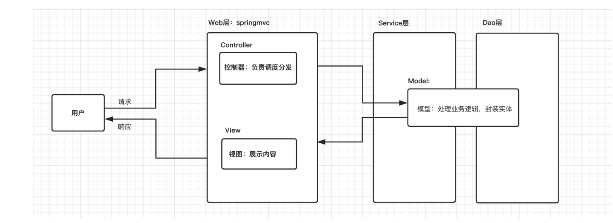
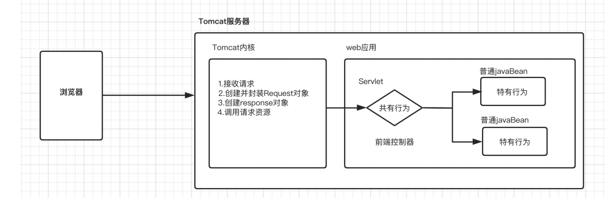
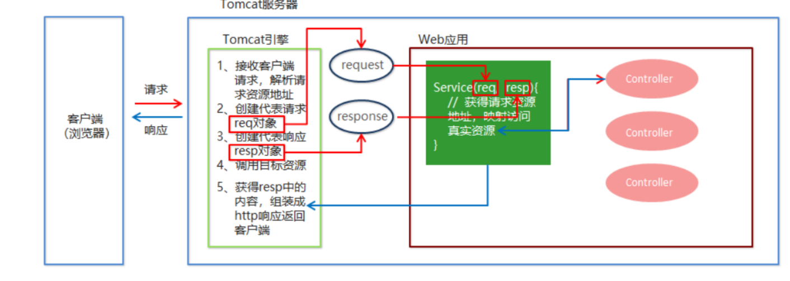
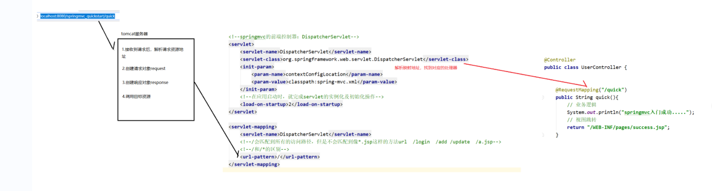
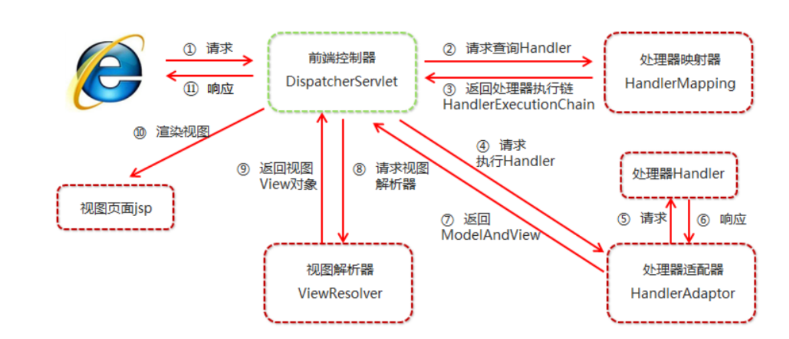
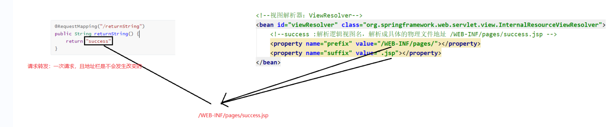
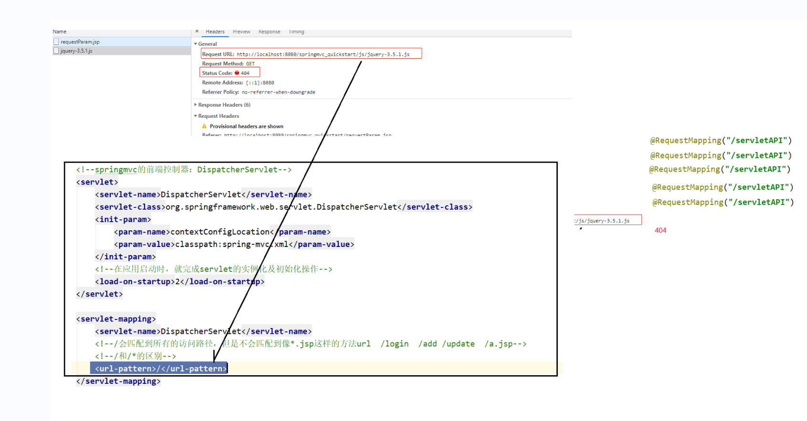

# **任务一：** **SpringMVC**基本应用

课程任务主要内容：

```
* SpringMVC简介 
* SpringMVC组件概述 
* SpringMVC请求 
* SpringMVC响应 
* 静态资源开启
```

## **一** **SpringMVC**简介

### **1.1 MVC**模式

MVC是软件工程中的一种软件架构模式，它是一种分离业务逻辑与显示界面的开发思想。

```
* M（model）模型：处理业务逻辑，封装实体
* V（view） 视图：展示内容 
* C（controller）控制器：负责调度分发（1.接收请求、2.调用模型、3.转发到视图）
```




### **1.2 SpringMVC**概述

SpringMVC 是一种基于 Java 的实现 MVC 设计模式的轻量级 Web 框架，属于SpringFrameWork 的后续产品，已经融合在 Spring Web Flow 中。

SpringMVC 已经成为目前最主流的MVC框架之一，并且随着Spring3.0 的发布，全面超越 Struts2，成为最优秀的 MVC 框架。它通过一套注解，让一个简单的 Java 类成为处理请求的控制器，而无须实现任何接口。同时它还支持 RESTful 编程风格的请求。



**总结**

SpringMVC的框架就是封装了原来Servlet中的共有行为；例如：参数封装，视图转发等。

### 1.3 SpringMVC快速入门

#### **需求**

客户端发起请求，服务器接收请求，执行逻辑并进行视图跳转。

#### **步骤分析**


```
1. 创建web项目，导入SpringMVC相关坐标 
2. 配置SpringMVC前端控制器 DispathcerServlet 
3. 编写Controller类和视图页面 
4. 使用注解配置Controller类中业务方法的映射地址 
5. 配置SpringMVC核心文件 spring-mvc.xml
```

#### **1**）创建****web****项目，导入****SpringMVC****相关坐标

```
<!-- 设置为web工程 -->
<packaging>war</packaging>

<dependencies>
<!--springMVC坐标-->
<dependency>

    <groupId>org.springframework</groupId>

    <artifactId>spring-webmvc</artifactId>

    <version>5.1.5.RELEASE</version>

</dependency>

<!--servlet坐标-->

<dependency>

<groupId>javax.servlet</groupId>

<artifactId>javax.servlet-api</artifactId>

<version>3.1.0</version>

<scope>provided</scope>

</dependency>

    <!--jsp坐标-->

    <dependency>

        <groupId>javax.servlet.jsp</groupId>

        <artifactId>jsp-api</artifactId>

        <version>2.2</version>

        <scope>provided</scope>

    </dependency>

</dependencies>
```

#### 2**）配置**SpringMVC前端控制器DispathcerServlet


```
<?xml version="1.0" encoding="UTF-8"?>
<web-app xmlns="http://xmlns.jcp.org/xml/ns/javaee"
         xmlns:xsi="http://www.w3.org/2001/XMLSchema-instance"
         xsi:schemaLocation="http://xmlns.jcp.org/xml/ns/javaee http://xmlns.jcp.org/xml/ns/javaee/web-app_4_0.xsd"
         version="4.0">

    <!--springmvc的前端控制器 DispathcerServlet-->
    <servlet>
        <servlet-name>DispatcherServlet</servlet-name>
        <servlet-class>org.springframework.web.servlet.DispatcherServlet</servlet-class>
        <init-param>
            <param-name>contextConfigLocation</param-name>
            <param-value>classpath:spring_mvc.xml</param-value>
        </init-param>
        <!--在应用启动时，就完成SERVLET的实例和初始化操作-->
        <load-on-startup>2</load-on-startup>
    </servlet>
    <servlet-mapping>
        <servlet-name>DispatcherServlet</servlet-name>
        <!--/的意思是可以匹配到所有的访问路径，不会匹配到像*.jsp这样的方法-->
        <!--/和/*的区别就是/*什么也能匹配到-->
        <url-pattern>/</url-pattern>
    </servlet-mapping>
</web-app>
```

```
在[SpringMVC](https://so.csdn.net/so/search?q=SpringMVC&spm=1001.2101.3001.7020)中 /* 和 / 的区别

/ ：会匹配到 /springmvc 这样的路径型url，而不会匹配到像 .jsp 这样的后缀型的url。

/* ：会匹配到所有的url：路径型url 和后缀型的url （包括/springmvc,.jsp,.js,和.html等）。
```


#### **3**）编写****Controller****类和视图页面


```
@Controller
public class UserController {

    @RequestMapping("/quick")
    public String quick(){
        //业务逻辑
        System.out.println("SpringMVC入门成功");
        //视图跳转
        return "/WEB-INF/pages/success.jsp";
    }
}
```


#### 4）使用注解配置****Controller****类中业务方法的映射地址


#### **5*）配置****SpringMVC****核心文件****spring-mvc.xml*

```
<?xml version="1.0" encoding="UTF-8"?>
<project xmlns="http://maven.apache.org/POM/4.0.0"
         xmlns:xsi="http://www.w3.org/2001/XMLSchema-instance"
         xsi:schemaLocation="http://maven.apache.org/POM/4.0.0 http://maven.apache.org/xsd/maven-4.0.0.xsd">
    <modelVersion>4.0.0</modelVersion>

    <groupId>com.cuiwei</groupId>
    <artifactId>springmvc_quickstart</artifactId>
    <version>1.0-SNAPSHOT</version>
    <!-- 设置为web工程 -->
    <packaging>war</packaging>

    <dependencies>
    <!--springMVC坐标-->
    <dependency>

        <groupId>org.springframework</groupId>

        <artifactId>spring-webmvc</artifactId>

        <version>5.1.5.RELEASE</version>

    </dependency>

    <!--servlet坐标-->

    <dependency>

    <groupId>javax.servlet</groupId>

    <artifactId>javax.servlet-api</artifactId>

    <version>3.1.0</version>

    <scope>provided</scope>

    </dependency>

        <!--jsp坐标-->

        <dependency>

            <groupId>javax.servlet.jsp</groupId>

            <artifactId>jsp-api</artifactId>

            <version>2.2</version>

            <scope>provided</scope>

        </dependency>

    </dependencies>

</project>
```


### **1.4 web**工程执行流程







执行具体的Controller方法前，先走了前端控制器，由前端控制器对映射地址进行解析，从而知道要执行哪个Controller中的哪个方法

### **1.5** **知识小结**

```
* SpringMVC是对MVC设计模式的一种实现，属于轻量级的WEB框架。
* SpringMVC的开发步骤： 
1.创建web项目，导入SpringMVC相关坐标
2.配置SpringMVC前端控制器 DispathcerServlet
3.编写Controller类和视图页面 
4.使用注解配置Controller类中业务方法的映射地址 
5.配置SpringMVC核心文件 spring-mvc.xml
```


## **二** **SpringMVC**组件概述

### **2.1 SpringMVC**的执行流程




(首先客户端发送请求后会先找到前端控制器DispatcherServlet，我们知道很多工作都是它进行封装的，其实不然，其实这个前端控制器它只负责进行调度，进行一个相应的组件调用，那在这个SpringMVC框架内部，很多功能都有对应的组件帮我们去完成，就是内部分工很明确，那么这个 DispatcherServlet 前端控制器首先根据你的请求 得知道你要找哪个资源，而找资源，解析资源的过程不是它来完成的，它去帮忙我们去请求一个叫HandlerMapping这么一个组件，这个组件我们成为处理器映射器，他负责对我们的请求进行解析，知道最终我们要找谁，它执行完返回的并不是某一个资源的地址，而返回的是一串资源地址。比如我们在web阶段的时候，如果地址在没有写错的情况下，我们那个Servlet是百分百可以被访问到的，但是后期我们学filter之后，我们会发现再去访问那个目标Servlet的时候，有可能会通过很多filter，最终才能到达Servlet，在这个地方也一样，这个SpringMVC后期要学Interceptor拦截器。所以说也有可能执行到那个目标Controller之前也要执行很多Interceptor，所以说它在执行过程中是执行很多资源，最终才能到达目标Controller，所以它返回的是HandlerExecutionChain，是一个链，这个链对象内部封装了你执行很多资源的顺序。

DispatcherServlet拿到HandlerExecutionChain后，它得帮你执行，同样也不是它来执行，而是再去调用HandlerAdaptor处理器适配器，它负责帮你去执行调度那些要被执行的资源，所以说就请求资源，找到Handler处理器，这个Handler处理器就可以理解为我们自己写的那个Controller，就是我们自己写的那个资源封装的对象，然后最终它返回，最后把模型和对象返回给DispatcherServlet，前端控制拿到这个模型和对象，它再去找视图解析器，ViewResolver，它负责从ModerAndView当中把视图对象解析出来，解出之后，当然这里的视图有很多种，我们目前接触最多的就是JSP，那么就是要对这个视图解析渲染，最终把这个内容返回给客户端。 )


1. ```
   1. 用户发送请求至前端控制器DispatcherServlet。 
   
   2. DispatcherServlet收到请求调用HandlerMapping处理器映射器。 
   
   3. 处理器映射器找到具体的处理器(可以根据xml配置、注解进行查找)，生成处理器对象及处理器拦截器(如 
   
   果有则生成)一并返回给DispatcherServlet。 
   
   4. DispatcherServlet调用HandlerAdapter处理器适配器。
   
   5. HandlerAdapter经过适配调用具体的处理器(Controller，也叫后端控制器)。 
   
   6. Controller执行完成返回ModelAndView。 
   
   7. HandlerAdapter将controller执行结果ModelAndView返回给DispatcherServlet。 
   
   8. DispatcherServlet将ModelAndView传给ViewReslover视图解析器。 
   
   9. ViewReslover解析后返回具体View。 
   
   10. DispatcherServlet根据View进行渲染视图（即将模型数据填充至视图中）。 
   
   11. DispatcherServlet将渲染后的视图响应响应用户。 
   ```

   ### **2.2 SpringMVC**组件解析

```
1. 前端控制器：
DispatcherServlet 用户请求到达前端控制器，它就相当于 MVC 模式中的 C，DispatcherServlet 是整个流程控制的 中心，由它调用其它组件处理用户的请求，DispatcherServlet 的存在降低了组件之间的耦合性。
2. 处理器映射器：
HandlerMapping HandlerMapping 负责根据用户请求找到 Handler 即处理器，SpringMVC 提供了不同的映射器 实现不同的映射方式，例如：配置文件方式，实现接口方式，注解方式等。 
3. 处理器适配器：
HandlerAdapter 通过 HandlerAdapter 对处理器进行执行，这是适配器模式的应用，通过扩展适配器可以对更多类型 的处理器进行执行。
4. 处理器（也就是自己编写的Controller）：
Handler【**开发者编写**】 它就是我们开发中要编写的具体业务控制器。由 DispatcherServlet 把用户请求转发到 Handler。由Handler 对具体的用户请求进行处理。 
5. 视图解析器：(其实就是对return的东西进行解析)。
ViewResolver View Resolver 负责将处理结果生成 View 视图，View Resolver 首先根据逻辑视图名解析成物 理视图名，即具体的页面地址，再生成 View 视图对象，最后对 View 进行渲染将处理结果通过页面展示给用户。
6. 视图：（就是我们编写的success.jsp）
View 【**开发者编写**】 
SpringMVC 框架提供了很多的 View 视图类型的支持，包括：jstlView、freemarkerView、 pdfView等。最常用的视图就是 jsp。一般情况下需要通过页面标签或页面模版技术将模型数据通过页面展 示给用户，需要由程序员根据业务需求开发具体的页面。 
***笔试题：springmvc中的三大组件是什么？
处理器映射器，处理器适配器 试图解析器
```


```java
<beans xmlns="http://www.springframework.org/schema/beans" 

xmlns:mvc="http://www.springframework.org/schema/mvc" 

xmlns:context="http://www.springframework.org/schema/context" 

xmlns:xsi="http://www.w3.org/2001/XMLSchema-instance" 

xsi:schemaLocation="http://www.springframework.org/schema/beans 

http://www.springframework.org/schema/beans/spring-beans.xsd 

http://www.springframework.org/schema/mvc 

http://www.springframework.org/schema/mvc/spring-mvc.xsd 

http://www.springframework.org/schema/context 

http://www.springframework.org/schema/context/spring-context.xsd">

   <!--开启注解扫描-->
    <context:component-scan base-package="com.cuiwei"></context:component-scan>

    <!--处理器映射器-处理器适配器  进行了功能的增强  支持json的读写-->
    <mvc:annotation-driven/>


    <!--视图解析器：ViewResolver-->
    <bean id="ViewResolver" class="org.springframework.web.servlet.view.InternalResourceViewResolver">
        <!--success :解析逻辑的视图名   解析成具体的物理文件地址  /WEB-INF/pages/successjsp-->
        
        <!--前缀-->
        <property name="prefix" value="/WEB-INF/pages/"></property>
        <!--后缀-->
        <property name="suffix" value=".jsp"></property>
    </bean>
</beans>
```

那么在Controller类中可以直接return ”success"    视图的逻辑名字了。

### **2.3 SpringMVC**注解解析

**@Controller**（应用于Web层）

SpringMVC基于Spring容器，所以在进行SpringMVC操作时，需要将Controller存储到Spring容器中，如果使用@Controller注解标注的话，就需要使用：

```
<!--配置注解扫描--> <context:component-scan base-package="com.lagou.controller"/>
```

一般情况，springmvc.xml文件中配置注解扫描，是直接配置到com.***.controller,而dao层和service的注解扫描配置，一般实在applicatonContext.xml中。（这里可以理解为springmvc.xml是applicationContext.xml的子容器）

**@RequestMapping**（request请求   mapping映射）

```
* 作用：用于建立请求 URL 和处理请求方法之间的对应关系 
* 位置：1.类上：请求URL的第一级访问目录。此处不写的话，就相当于应用的根目录。写的话需要以/开头。 它出现的目的是为了使我们的URL可以按照模块化管理: （例如http://localhost:8080/springmvc_quickstart/user/quick）

用户模块/user/add
/user/update 
/user/delete ... 

账户模块
/account/add 
/account/update 
/account/delete 

2.方法上：请求URL的第二级访问目录，和一级目录组成一个完整的 URL 路径。 
* 属性：
1.value：用于指定请求的URL。它和path属性的作用是一样的 
2.method：用来限定请求的方式
3.params：用来限定请求参数的条件 

例如：params={"accountName"} 表示请求参数中必须有accountName pramss={"money!100"} 表示请求参数中money不能是100
```


### **2.4** **知识小结**

```
* SpringMVC的三大组件 处理器映射器：HandlerMapping 处理器适配器：HandlerAdapter 视图解析器：View Resolver

* 开发者编写 处理器：Handler 视图：View
```

## **三** **SpringMVC**的请求

### **3.1** **请求参数类型介绍**

客户端请求参数的格式是： name=value&name=value……

服务器要获取请求的参数的时候要进行类型转换，有时还需要进行数据的封装

SpringMVC可以接收如下类型的参数：

- 基本类型参数

- 对象类型参数

- 数组类型参数

- 集合类型参数


### **3.2** **获取基本类型参数**

Controller中的业务方法的参数名称要与请求参数的name一致，参数值会自动映射匹配。并且能自动类型转换；自动的类型转换是指从String向其他类型的转换。

```
${pageContext.request.contextPath}是JSP取得绝对路径的方法，等价于<%=request.getContextPath()%> 。
也就是取出部署的应用程序名或者是当前的项目名称。

比如我的项目名称是SSM在浏览器中输入为 http://localhost:8080/SSM/index.jsp
${pageContext.request.contextPath}或<%=request.getContextPath()%>取出来的就是/SSM,
而"/"代表的含义就是 http://localhost:8080

```

```
%--动态获取当前项目路径   a标签是get请求--%>
<a href="${pageContext.request.contextPath}/user/simpleParam?id=1&username=杰克">
    基本类型参数
</a>
```

```
/**
 * 获取基本数据类型
 */
@RequestMapping("/simpleParam")
public String simpleParam(Integer id,String username){
    System.out.println(id);
    System.out.println(username);
    return "success";
}
```

注意：这里的jsp文件不要直接放在WEB-INF下，因为WEB-INF是安全目录，浏览器不能直接访问，要把其放在webapp下。

### **3.3** **获取对象类型参数**

Controller中的业务方法参数的POJO属性名与请求参数的name一致，参数值会自动映射匹配。

```
<%--该表单提交的请求类型为post类型--%>
    <form action="${pageContext.request.contextPath}/user/pojoParam" method="post">
        编号<input type="text" name="id"><br>
        用户名<input type="text" name="username">
        <input type="submit" value="对象类型参数">
    </form>
```

User实体：

```
public class User {
    private  Integer id;
    private String username;

    public void setId(Integer id) {
        this.id = id;
    }

    public void setUsername(String username) {
        this.username = username;
    }

    public Integer getId() {
        return id;
    }

    public String getUsername() {
        return username;
    }

    @Override
    public String toString() {
        return "User{" +
                "id=" + id +
                ", username='" + username + '\'' +
                '}';
    }
}
```

Controller:

```
/**
 * 获取对象类型参数
 */
@RequestMapping("/pojoParam")
public String pojoParam(User user){
    System.out.println(user);
    return "success";
}
```

这里有中文乱码问题，是因为tomcat8.5解决了get请求的中文乱码，但是没有解决post中文乱码。

注意：这里的参数名和User实体中的参数名要保持一致，User实体一定要重写set方法，因为SpringMVC调用set方法来进行值的注入

### **3.4** **中文乱码过滤器**

当post请求时，数据会出现乱码，我们可以设置一个过滤器来进行编码的过滤。

```
!--中文乱码过滤器-->
<filter>
    <filter-name>CharacterEncodingFilter</filter-name>
    <filter-class>org.springframework.web.filter.CharacterEncodingFilter</filter-class>
    <init-param>
        <param-name>encoding</param-name>
        <param-value>UTF-8</param-value>
    </init-param>
</filter>
<filter-mapping>
    <filter-name>CharacterEncodingFilter</filter-name>
    <url-pattern>/*</url-pattern>
</filter-mapping>
```

init-param>标签是为了设置该过滤器的初始化编码格式为UTF-8

/*是为了在请求中都要走一遍过滤器

### **3.5** **获取数组类型参数**

Controller中的业务方法数组名称与请求参数的name一致，参数值会自动映射匹配。

```java
<%--获取数组类型的请求参数--%>
<form action="${pageContext.request.contextPath}/user/arrayParam" method="post">
    编号<input type="checkbox" name="ids" value="1"><br>
    <input type="checkbox" name="ids" value="2"><br>
    <input type="checkbox" name="ids" value="3"><br>
    <input type="checkbox" name="ids" value="4"><br>
    <input type="checkbox" name="ids" value="5"><br>
    <input type="submit" value="数组类型参数">
</form>
```

```
/**
 * 获取数组类型的请求参数
 */
@RequestMapping("/arrayParam")
public String arrayParam(Integer[] ids){
    System.out.println(Arrays.toString(ids));
    return "success";
}
```


### **3.6** **获取集合（复杂）类型参数**

获得集合参数时，要将集合参数包装到一个POJO中才可以。

```jsp
<%--获取集合类型的请求参数--%>

<form action="${pageContext.request.contextPath}/user/queryParam" method="post">

    搜索关键字：<input type="text" name="keyword">

    user对象：
    <input type="text" name="user.id" placeholder="编号">
    <input type="text" name="user.name" placeholder="性命">

    list集合：
    第一个元素
    <input type="text" name="userList[0].id" placeholder="编号">
    <input type="text" name="userList[0].username" placeholder="姓名">

    第二个元素
    <input type="text" name="userList[1].id" placeholder="编号">
    <input type="text" name="userList[1].username" placeholder="姓名">

    map集合:

    第一个元素
    <input type="text" name="userMap['u1'].id" placeholder="编号">
    <input type="text" name="userMap['u1'].username" placeholder="姓名">

    第二个元素：
    <input type="text" name="userMap['u2'].id" placeholder="编号">
    <input type="text" name="userMap['u2'].username" placeholder="姓名">

    <input type="submit" value="复杂类型参数">
    
</form>
```


```java
public class QueryVo {
    private String keyword;
    private User user;
    private List<User> userList;
    private Map<String,User> userMap;

    public String getKeyword() {
        return keyword;
    }

    public void setKeyword(String keyword) {
        this.keyword = keyword;
    }

    public User getUser() {
        return user;
    }

    public void setUser(User user) {
        this.user = user;
    }

    public List<User> getUserList() {
        return userList;
    }

    public void setUserList(List<User> userList) {
        this.userList = userList;
    }

    public Map<String, User> getUserMap() {
        return userMap;
    }

    public void setUserMap(Map<String, User> userMap) {
        this.userMap = userMap;
    }

    @Override
    public String toString() {
        return "QueryVo{" +
                "keyword='" + keyword + '\'' +
                ", user=" + user +
                ", userList=" + userList +
                ", userMap=" + userMap +
                '}';
    }
}
```

```
/**
 * 获取集合类型的请求参数
 */
@RequestMapping("/queryParam")
public String quertParam(QueryVo queryVo){

    System.out.println(queryVo);
    return "success";
}
```

### **3.7** **自定义类型转换器**


SpringMVC 默认已经提供了一些常用的类型转换器；例如：客户端提交的字符串转换成int型进行参数设置，**日期格式类型要求为：yyyy/MM/dd 不然的话会报错**，对于特有的行为，SpringMVC提供了自定义类型转换器方便开发者自定义处理。

表单：

```jsp
<%--自定义类型转换器  ： 错误的产生 2021/12/12--%>
<form action="${pageContext.request.contextPath}/user/coverParam" method="post">
   生日：<input type="text" name="birthday">
    <input type="submit" value="自定义类型转换器">
</form>
</body>
```

转换器类：

```java
public class DateConverter implements Converter<String , Date> {
    //这里的s  就是表单传递和过来的请求参数
    public Date convert(String s) {
        //将日期字符串转换为日期对象返回
        SimpleDateFormat simpleDateFormat = new SimpleDateFormat("yyyy-MM-dd");
        Date date = null;
        try {
             date = simpleDateFormat.parse(s);
        } catch (ParseException e) {
            e.printStackTrace();
        }
        return date;
    }
}
```

**这里Converter<S，T> 是一个可以将一种数据类型转换成另一种数据类型的接口**，这里 S 表示源类型，T 表示目标类型。内置的类型转换已经，满足不了，所以去使用自定义类。

将日期对象转换为字符串用format;将日期字符串对象转换为日期对象用parse。

在spring_mvc.xml中进行转换器的配置：

```xml
<!--自定义类型转换器配置-->
<bean id="ConversionService" class="org.springframework.context.support.ConversionServiceFactoryBean">
    <property name="converters">
        <set>
            <bean class="com.cuiwei.converter.DateConverter"></bean>
        </set>
    </property>
</bean>

 <!--处理器映射器-处理器适配器  进行了功能的增强  支持json的读写-->
    <mvc:annotation-driven conversion-service="ConversionService"/>
```

**ConversionService 只是个Service，对于每个类型转换的操作，它并不是最终的操作者，它会将相应操作交给对应类型的转换器。**

### 3.8 相关注解

#### @RequestParam

当请求的参数name名称与Controller的业务方法参数名称不一致时，就需要通过@RequestParam注解显示的绑定

```
<%--演示@RequestParam标签--%>
<a href="${pageContext.request.contextPath}/user/findByPage?pageNo=2">分页查询</a>
```

```
 /**
  * 演示@RequestParam注解
  * RequestParam
  *  name 就是匹配页面传递参数的名称
  *  defaultValue  设置参数的默认值
  *  required  设置是否必须传递该参数，默认值为true。 如果设置为默认值，值自动改为false，也就是前台你传递不传递参数已经不重要了，你有参数，那么就接受你的参数，没有则走默认值。
  */
@RequestMapping("/findByPage")
 public String findByPage( @RequestParam(name="pageNo",defaultValue = "1",required = false)Integer pageNum,@RequestParam(defaultValue = "5") Integer pageSize){
     System.out.println(pageNum);
     System.out.println(pageSize);
     return "success";
 }
```

#### **@RequestHeader**

获取请求头的数据。

```
@RequestMapping("/RequestHeader")
public String requestHead(@RequestHeader("cookie") String cookie){
    System.out.println(cookie);
    return "success";
}
```

#### **@CookieValue**

获取cookie中的数据。

```
@RequestMapping("/CookieValue")
public String cookieValue(@CookieValue("JESSIONID") String jessionId){
    System.out.println(jessionId);
    return "success";
}
```

### **3.9** **获取**Servlet****相关****API

SpringMVC支持使用原始ServletAPI对象作为控制器方法的参数进行注入，常用的对象如下：

```
@RequestMapping("/servletAPI") 
public String servletAPI(HttpServletRequest request, HttpServletResponse response, HttpSession session) { System.out.println(request); 
System.out.println(response); 
System.out.println(session); 
return "success";
}
```

## **四** **SpringMVC**的响应

### **4.1 SpringMVC**响应方式介绍

#### **页面跳转**

1. 返回字符串逻辑视图

2. void原始ServletAPI

3. ModelAndView

#### **返回数据**

1. 直接返回字符串数据

2. 将对象或集合转为json返回（任务二演示）

### **4.2** **返回字符串逻辑视图**

直接返回字符串：此种方式会将返回的字符串与视图解析器的前后缀拼接后跳转到指定页面



### **4.3 void**原始****ServletAPI

```java
/**
 * 进行原始servletAPI进行的页面跳转
 */

@RequestMapping("/returnVoid")
public void returnVoid(HttpServletRequest request, HttpServletResponse response) throws Exception{

    //借助request对象完成请求转发 一次请求
    //request.getRequestDispatcher("WEB-INF/pages/success.jsp").forward(request,response);

    //借助response对象完成重定向，两次请求   

    response.sendRedirect(request.getContextPath() + "/index.jsp");

}
```

```
注意：在进行重定向的时候不能直接动态获取路径+WEB-INF下的东西，因为WEB-INF是安全目录，不允许外部请求直接访问该目录资源，只可以进行服务器内部转发。
```


### **4.4** **转发和重定向**

企业开发我们一般使用返回字符串逻辑视图实现页面的跳转，这种方式其实就是请求转发。

**我们也可以写成：**forward：****请求转发

如果用了**forward：**则路径必须写成实际视图url，不能写逻辑视图。它相当于：

```
request.getRequestDispatcher("url").forward(request,response) 
```

使用请求转发，既可以转发到jsp，也可以转发到其他的控制器方法。

```
RequestMapping("/forward")
public String forword(){
 
        //还想在模型中设置一些值怎么做
        model.addAttribute("username","崔巍");
    /**
     * 使用forward请求转发，既可以转发到jsp,也可以转发到其他控制器方法
     */
    return "forward: /WEB-INF/pages/success.jsp";
}


在success.jsp中使用${}获取内容 
```

model模型的作用就是封装存放数据

**Redirect**重定向

我们可以不写虚拟目录，springMVC框架会自动拼接，并且将Model中的数据拼接到url地址上

```java
@RequestMapping("/redirect")
public String redirect(Model model){
    model.addAttribute("username","cuiwei");
    return "redirect:/index.jsp";
}
```

注意这里如果在index.jsp文件中使用${}，获取username，是获取不到的，因为model.addAttribute的底层是request.setAttribute,request域范围是一次请求，而你的重定向是两次请求，所以取不出来。


#### 4.4补充：

当我们使用了forward,和redirect关键字以后，就不会再走视图解析器，也就不会再执行前后缀的拼接，而是直接走他的底层。


### **4.5 ModelAndView** 

#### **4.4.1** **方式一**

在Controller中方法创建并返回ModelAndView对象，并且设置视图名称

```
@RequestMapping("/ModelandView")
public ModelAndView ModelandView(Model model){
    /**
     * model  模型用来封装存放数据
     * view  用来展示数据
     */
    ModelAndView modelAndView = new ModelAndView();

    //设置要存放的数据
    modelAndView.addObject("username","崔巍要努力");

    //设置视图的名称，视图解析器解析modelandview拼接前缀和后缀
    modelAndView.setViewName("success");

    return modelAndView;

   }
```

#### **4.4.2** **方式二**

在Controller中方法形参上直接声明ModelAndView，无需在方法中自己创建，在方法中直接使用该

对象设置视图，同样可以跳转页面

```
@RequestMapping("/ModelandView2")
 public ModelAndView ModelandView2(ModelAndView modelAndView){
     /**
      * model  模型用来封装存放数据
      * view  用来展示数据
      */

     //设置要存放的数据
     modelAndView.addObject("username","崔巍要努力yayaya");

     //设置视图的名称，视图解析器解析modelandview拼接前缀和后缀
     modelAndView.setViewName("success");

     return modelAndView;

 }
```

### **4.6 @SessionAttributes**

如果在多个请求之间共用数据，则可以在控制器类上标注一个 @SessionAttributes,配置需要在session中存放的数据范围，Spring MVC将存放在model中对应的数据暂存到 HttpSession 中。

```java
@SessionAttributes("username")  //向request域中存入key为username时，会同步到session域中
```

#### 注意：@SessionAttributes只能定义在类上

### **4.7** **知识小结**

```
* 页面跳转采用返回字符串逻辑视图 
	1.forward转发 可以通过Model向request域中设置数据 
	2.redirect重定向 直接写资源路径即可，虚拟目录springMVC框架自动完成拼接


* 数据存储到request域中 Model model 
model.addAttribute("username", "子慕");
使用model也就是把数据存到request域中，也就是只能进行一次请求。
```

## **五 静态资源访问的开启**

​     当有静态资源需要加载时，比如jquery文件，通过谷歌开发者工具抓包发现，没有加载到jquery文件，原因是SpringMVC的前端控制器DispatcherServlet的url-pattern配置的是 /（缺省）,代表对所有的静态资源都进行处理操作，这样就不会执行Tomcat内置的DefaultServlet处理，我们可以通过以下两种方式指定放行静态资源：

**方式一**

```
<!--在springmvc配置文件中指定放行资源--> 

<mvc:resources mapping="/js/**" location="/js/"/> 

<mvc:resources mapping="/css/**" location="/css/"/> 

<mvc:resources mapping="/img/**" location="/img/"/> 
```

**方式二：**

DefaultServlet：是Tomcat内置的。

```
<!--在springmvc配置文件中开启DefaultServlet处理静态资源    放行所有的静态资源--> 

<mvc:default-servlet-handler/>


```



意思就是拿着/js/jquuery...这个路径与你Controller中的每个方法的路径，进行比较，看与哪个一致，不一致，便会报404.