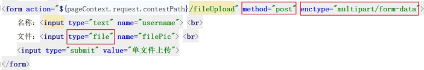
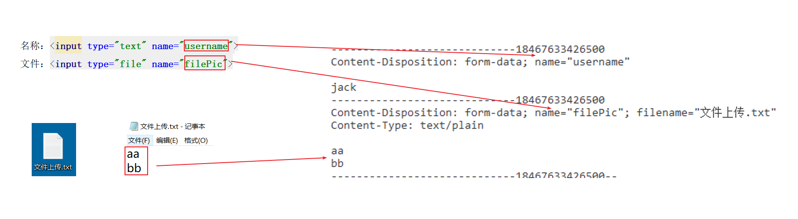
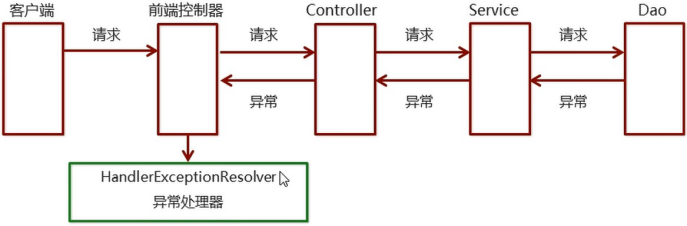
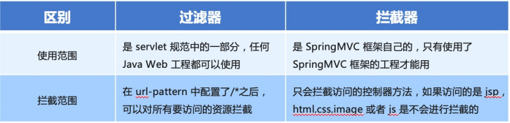
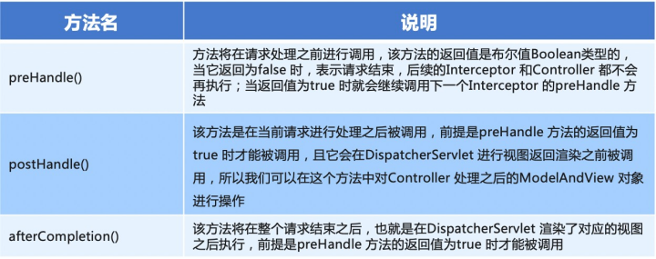

# **任务二：**springmvc****进阶

**课程任务主要内容：**

```
* ajax异步交互
* RESTful 
* 文件上传
* 异常处理 
* 拦截器
```

## **一** **ajax**异步交互

 Ajax是一种使用现有技术集合，技术内容包括: HTML 或 XHTML, CSS, JavaScript, DOM, XML, XSLT, 以及最重要的XMLHttpRequest。
         用于浏览器与服务器之间使用异步数据传输(HTTP 请求),做到局部请求以实现局部刷新。

Springmvc默认用MappingJackson2HttpMessageConverter对json数据进行转换，需要加入jackson的包；同时使用 <mvc:annotation-driven />

导入包：

```
<dependency>
    <groupId>com.fasterxml.jackson.core</groupId>
    <artifactId>jackson-databind</artifactId>
    <version>2.9.8</version>
</dependency>
<dependency>
    <groupId>com.fasterxml.jackson.core</groupId>
    <artifactId>jackson-core</artifactId>
    <version>2.9.8</version>
</dependency>
<dependency>
    <groupId>com.fasterxml.jackson.core</groupId>
    <artifactId>jackson-annotations</artifactId>
    <version>2.9.0</version>
</dependency>
```

### **1.1 @RequestBody**（将前台的Json数据转换为对象

该注解用于Controller的方法的形参声明，当使用ajax提交并指定contentType为json形式时，通过HttpMessageConverter接口转换为对应的POJO对象。(当将JSON格式转换为集合或者对象的时候，要用到该标签)

```
/**
 * ajax异步交互
 */
@RequestMapping("/ajaxRequest")
public void ajaxRequest(@RequestBody List<User> list){
    System.out.println(list);

}
```

```
<script src = "${pageContext.request.contextPath}/js/jquery-3.5.1.js"></script>
<%--ajax异步交互--%>

<button id="btn1">ajax异步提交</button>

<script>
    $("#btn1").click(function () {

        let url = '${pageContext.request.contextPath}/user/ajaxRequest';

        let data = '[{"id":1,"username":"崔巍"},{"id":2,"username":"李慧糠"}]'

        $.ajax({
            type:'post',
            url:url,
            data:data,
            contentType :'application/json;charset = utf-8',
            success:function (resp) {
                alert(resp);

            }
        })

    })
</script>
```

### **1.2 @ResponseBody**（将数据转换为JSON响应给前台）

该注解用于将Controller的方法返回的对象，通过HttpMessageConverter接口转换为指定格式的数据如：json,xml等，通过Response响应给客户端。

```java
/**
 * ajax异步交互
 */
@RequestMapping("/ajaxRequest")
 @ResponseBody
public List<User> ajaxRequest(@RequestBody List<User> list){
    System.out.println(list);
    return list;

}
```

```javascript
<script src = "${pageContext.request.contextPath}/js/jquery-3.5.1.js"></script>
<%--ajax异步交互--%>

<button id="btn1">ajax异步提交</button>

<script>
    $("#btn1").click(function () {

        let url = '${pageContext.request.contextPath}/user/ajaxRequest';

        let data = '[{"id":1,"username":"崔巍"},{"id":2,"username":"李慧糠"}]'

        $.ajax({
            type:'post',
            url:url,
            data:data,
            contentType :'application/json;charset = utf-8',
            success:function (resp) {
                alert(JSON.stringify(resp));

            }
        })

    })
</script>
```

## **二**  **RESTful**

### **2.1** **什么是**RESTful

Restful是一种软件架构风格、设计风格，而不是标准，只是提供了一组设计原则和约束条件。主要用于客户端和服务器交互类的软件，基于这个风格设计的软件可以更简洁，更有层次，更易于实现缓存机制等。

Restful风格的请求是使用“url+请求方式”表示一次请求目的的，HTTP 协议里面四个表示操作方式的动词如下：

(1)GET：读取（Read）

(2)POST：新建（Create）

(3)PUT：更新（Update）

(4)DELETE：删除（Delete） 

| 客户端请求 | 原来风格的URL地址   | RESTful风格的URL地址    |
| ---------- | ------------------- | ----------------------- |
| 查询所有   | /user/findall       | GET           /user     |
| 根据ID查询 | /user/findById?id=1 | GET           /user/{1} |
| 新增       | /user/save          | POST         /user      |
| 修改       | /user/update        | PUT           /user     |
| 删除       | /user/delete?id=1   | DELETE      /user/{1}   |

### **2.2** **代码实现**

#### **@PathVariable**

用来接收RESTful风格请求地址中占位符的值。

#### **@RestController**

RESTful风格多用于前后端分离项目开发，前端通过ajax与服务器进行异步交互，我们处理器通常返回的是json数据所以使用@RestController来替代@Controller和@ResponseBody两个注解。也就是组合主键：@RestController = @Controller+@ResponseBody

#### @GetMapping......(其他原理也是这样)

GetMapping可以直接替代@RequestMapping(value = "/user/{id}",method = RequestMethod.GET)。

```java
@RestController
@RequestMapping("/restful")
public class RestfulController {

    /**
     * 根据ID进行查询
     */
    @GetMapping("/user/{id}")
    这里的id要和参数id保持一致。
    public String findById(@PathVariable Integer id){
        //调用service方法，完成id为2的这条记录的查询
        //问题findById方法中怎么才能获取到restful编程风格里面占位符的值
        return "findById:" + id;

    }

    /**
     * 新增的方法
     */

    @PostMapping("/user")
    public String post(){
        //新增
        return "post";
    }


    /**
     * 更新方法
     */

    @PutMapping("/user")
    public String put(){
        return "PUT";
    }


    /**
     * 删除方法
     */

    @DeleteMapping("/user/{id}")
    public String delete( @PathVariable Integer id){
        return "delete" + id;
    }
```

## **三 文件上传**

### **3.1** **文件上传三要素**

（1）表单项 type="file"

（2）表单的提交方式 method="POST"

注意：get没有请求体，post有。

(3)表单的enctype属性是多部分表单形式 enctype=“multipart/form-data"（**必须用**）

form表单中的enctype属性的三点作用如下：

```
一、 application/x-www-form-urlencoded

   这是通过表单发送数据时默认的编码类型。我们没有在from标签中设置enctype属性时默认就是application/x-www-form-urlencoded类型的。application/x-www-form-urlencoded编码类型会把表单中发送的数据编码为名称/值对。这是标准的编码格式。当表单的ACTION为POST的时候，浏览器把form数据封装到http body中，然后发送到服务器。当表单的ACTION为GET的时候，application/x-www-form-urlencoded编码类型会把表单中发送的数据转换成一个字符串(name=coderbolg&key=php),然后把这个字符串附加到URL后面，并用?分割，接着就请求这个新的URL。当我们通过POST方式向服务器发送AJAX请求时最好要通过设置请求头来指定为application/x-www-form-urlencoded编码类型。方法是在xmlobject.open()方法之后添加

二、 multipart/form-data
    这个是专门用来传输特殊类型数据的，如我们上传的非文本的内容，比如图片或者MP3等。这种编码类型不对字符编码，数据通过二进制的形式传送到服务器端，这时如果用request是无法直接获取到相应表单的值的，而应该通过stream流对象，将传到服务器端的二进制数据解码，从而读取数据。

三、 text/plain
    数据以纯文本形式进行编码，其中不含任何控件或格式字符。
```



### **3.2** **文件上传原理**

- 当form表单修改为多部分表单时，request.getParameter()将失效。
- 当form表单的enctype取值为 application/x-www-form-urlencoded 时，
- ​       form表单的正文内容格式是： name=value&name=value 
- 当form表单的enctype取值为 mutilpart/form-data 时，请求正文内容就变成多部分形式：




### **3.3** **单文件上传**

**步骤分析**

```
1.导入fileupload和io坐标
2.配置文件上传解析器
3.编写文件上传代码
```

#### (1)导入fileupload和io坐标

```
<dependency>

    <groupId>commons-fileupload</groupId>

    <artifactId>commons-fileupload</artifactId>

    <version>1.3.3</version>

</dependency>

<dependency>

    <groupId>commons-io</groupId>

    <artifactId>commons-io</artifactId>

    <version>2.6</version>

</dependency>
```

#### **2**）配置文件上传解析器

```
<!--配置文件上传解析器-->
<bean id="multipartResolver" class="org.springframework.web.multipart.commons.CommonsMultipartResolver">
    <!--设置文件上传的最大值     5MB-->
    <property name="maxInMemorySize" value="5242880"></property>
    <!--设置文件上传时写入内存的最大值，如果小于这个参数不会生成临时文件 默认为10240-->
    <property name="maxInMemorySize" value="40960"></property>
</bean>
```

#### **3**）编写文件上传代码

```
@Controller
public class FileUploadController {

    /**
     * 单文件上传
     */

    @RequestMapping("/fileupload")
    public String fileUpload(String username, MultipartFile filePic) throws IOException {

        //获取表单的提交参数，完成上传
        System.out.println(username);
        //获取原始的文件上传名
        String originalFilename = filePic.getOriginalFilename();
        //上传文件
        filePic.transferTo(new File("D:\\upload/" + originalFilename));
        return "success";
    }
        }
```

### **3.4** **多文件上传**

表单：

```jsp
<form action="${pageContext.request.contextPath}/filesUpload" method="post" enctype="multipart/form-data">
名称：<input type="text" name="username"> <br>
文件1：<input type="file" name="filePic"> <br>
文件2：<input type="file" name="filePic"> <br>
<input type="submit" value="多文件上传">
</form>
```

编写上传代码：

```
@RequestMapping("/filesUpload")
public String filesUpload(String username, MultipartFile[] filePic) throws IOException {
System.out.println(username);
for (MultipartFile multipartFile : filePic) {
// 获取文件名
String originalFilename = multipartFile.getOriginalFilename();
// 保存到服务器
multipartFile.transferTo(new File("d:/upload/" + originalFilename));
}
return "success";
}
```


## **四 异常处理**

### **4.1** **异常处理的思路**

在Java中，对于异常的处理一般有两种方式:

- 一种是当前方法捕获处理（try-catch），这种处理方式会造成业务代码和异常处理代码的耦合。
- 另一种是自己不处理，而是抛给调用者处理（throws），调用者再抛给它的调用者，也就是一直向上抛。

在这种方法的基础上，衍生出了SpringMVC的异常处理机制。

系统的dao、service、controller出现都通过throws Exception向上抛出，最后由springmvc前端控器交由异常处理器进行异常处理，如下图：



### **4.2** **自定义异常处理器**

为了替代SpringMvc默认的异常处理器

#### **步骤分析**

```
1.创建异常处理器类实现HandlerExceptionResolver
2.配置异常处理器
3.编写异常页面
4.测试异常跳转
```

#### **1**）创建异常处理器类实现****HandlerExceptionResolver

```
public class GlobalExceptionResolver implements HandlerExceptionResolver {
    /**
    Exception e 就是我们抛出的异常对象
     */
    public ModelAndView resolveException(HttpServletRequest httpServletRequest, HttpServletResponse httpServletResponse, Object o, Exception e) {
        
        //具体的异常处理，产生异常后，跳转到最终的页面

        ModelAndView modelAndView = new ModelAndView();
        //获取异常内容
        modelAndView.addObject("error",e.getMessage());
        //实现跳转
        modelAndView.setViewName("error");
        return null;
    }
}
```

#### **2**）配置异常处理器

```JAVA
<!--配置自定义异常类-->
<bean id="globalExceptionResolver" class="com.cuiwei.exception.GlobalExceptionResolver"></bean>
```

#### **3**）编写异常页面


#### **4**）测试异常跳转

```JAVA
@Controller
public class ExceptionController {

    @RequestMapping("/testException")
    public String testException(){
        int i  = 1/ 0;
        return "success";
    }
}
```

### **4.3 web**的处理异常机制

```xml
<error-page>
    <error-code>404</error-code>
    <location>/404.jsp</location>
</error-page>

<error-page>
    <error-code>500</error-code>
    <location>/500.jsp</location>
</error-page>
```

<error-code>是出现的错误码。

## **五 拦截器**

### **5.1** **拦截器（**interceptor****）的作用

Spring MVC 的**拦截器**类似于 Servlet 开发中的过滤器 Filter，用于对处理器进行**预处理**和**后处理**。

也就是在处理器处理业务前后进行一些操作。

将拦截器按一定的顺序联结成一条链，这条链称为**拦截器链（**InterceptorChain****）。在访问被拦截的方法或字段时，拦截器链中的拦截器就会按其之前定义的顺序被调用。拦截器也是AOP思想的具体实现。

### **5.2** **拦截器和过滤器区别**

关于interceptor和filter的区别，如图所示：



### **5.3** **快速入门**

#### **步骤分析**

```
1.创建拦截器类实现HandlerInterceptor接口
2.配置拦截器
3.测试拦截器的拦截效果
```

#### **1**）创建拦截器类实现****HandlerInterceptor****接口


```
public class MyInterceptor1 implements HandlerInterceptor {

// 在目标方法执行之前 拦截
@Override
public boolean preHandle(HttpServletRequest request, HttpServletResponse response, Object handler) {
System.out.println("preHendle1");
return true; //这里如果是false那么在执行该方法后，就不再执行了
   }

// 在目标方法执行之后,视图对象返回之前执行
@Override
public void postHandle(HttpServletRequest request, HttpServletResponse response, Object handler, ModelAndView modelAndView) {
System.out.println("postHandle1");
}

// 在流程都执行完毕后执行
@Override
public void afterCompletion(HttpServletRequest request, HttpServletResponse response, Object handler, Exception ex) {
System.out.println("afterCompletion1");
     }
}
```


####  **2**）配置拦截器

```
<!--配置拦截器-->
<mvc:interceptors>
<mvc:interceptor>
<!--对哪些资源执行拦截操作-->
<mvc:mapping path="/**"/>   对所有的controller中的方法都要进行拦截
<bean class="com.lagou.interceptor.MyInterceptor1"/>   自己定义的拦截器
</mvc:interceptor>
</mvc:interceptors>
```


#### **3**）测试拦截器的拦截效果

```
@Controller
public class TargetController {

@RequestMapping("/target") public String targetMethod() {
System.out.println("目标方法执行了...");
return "success";
   }
}
```

编写JSP：

```
<%@ page contentType="text/html;charset=UTF-8" language="java" %>
<html>
<head>
<title>success</title>
</head>
<body>
<h3>success...</h3>
<% System.out.println("视图执行了	");%>
</body>
</html>
```


### **5.4** **拦截器链**

开发中拦截器可以单独使用，也可以同时使用多个拦截器形成一条拦截器链。开发步骤和单个拦截器是一样的，只不过注册的时候注册多个，注意这里注册的顺序就代表拦截器执行的顺序。

```
<!--配置拦截器-->
<mvc:interceptors>
<mvc:interceptor>
<!--拦截器路径配置-->
<mvc:mapping path="/**"/>
<!--自定义拦截器类-->
<bean class="com.lagou.interceptor.MyInterceptor1"></bean>
</mvc:interceptor>
<mvc:interceptor>
<!--拦截器路径配置-->
<mvc:mapping path="/**"/>
<!--自定义拦截器类-->
<bean class="com.lagou.interceptor.MyInterceptor2"></bean>
</mvc:interceptor>
</mvc:interceptors>
```

**注意：前置拦截器谁先配置的谁先拦截，后置拦截器相反。**

### **5.5** **知识小结**



